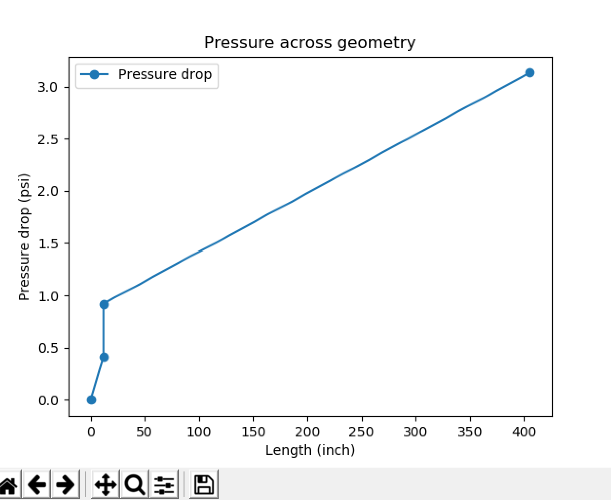

# **pipe_analysis**

## **Installation**
run the following: `pip install -r requirements.txt`

## **Guidelines**
1. For code version control:
  -  Please use python 3 in order to be consistent on packages version control
  - Please write down detailed description/messages when you commit; style: "issue_number-description-purpose-file(s)_name_you_commited". This makes it easier to trace code changes.
  - Please remember to git pull every time before you start to edit any .py

2. For high level view of variable location and code structure:
   `SUAVE 2.0`

3. For code management:
   `Gitkraken` `Glo Board` `Atom`

## **Coding style**
http://suave.stanford.edu/documentation/code_style.html
### **Naming Convention**
#### In terms of typography:

- any_variable_name - lower case with underscore. This includes working variables and instantiated objects.
- field_name - lower case with underscore Any field of an object should be lower case.
- function_name - lower case with underscore
- Class_Type - upper case with underscore. The underscores are chosen here to permit the inclusion of acronyms if needed and to maintain symmetry with field name styling.
- Package_Name - upper case with underscore. For example folders within the SUAVE package.

#### In terms of naming:
- Chunk similar field types under a containing field
- Bias names towards being specific
- Write out field name verbosely, but try to keep short

## **Anaconda**
To list all discoverable environments, type: `conda info --envs`.

To activate enviroment, type: `conda activate <environmentName>`

To deactivate an environment, type: `conda deactivate`

To create an environment, type: `conda create --name <environmentName>`

### **GitKraken signup below!**
https://www.gitkraken.com/invite/gN1gNQGw

